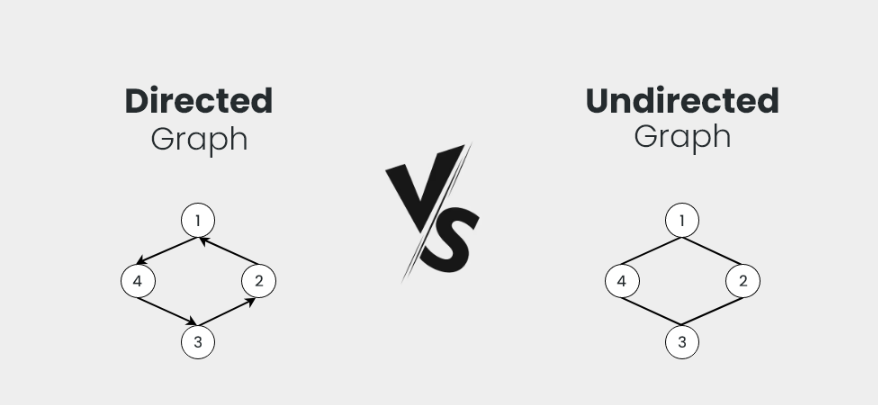
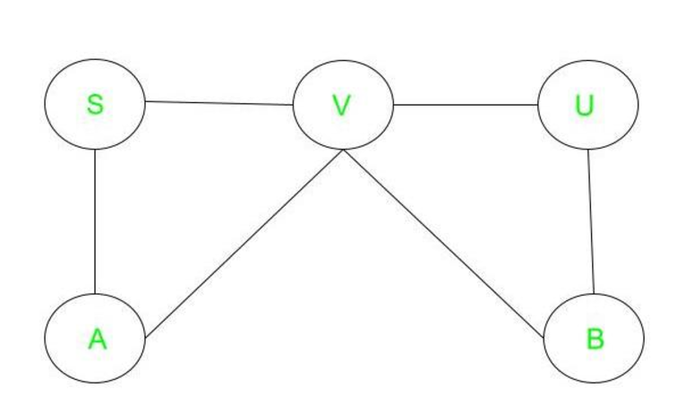
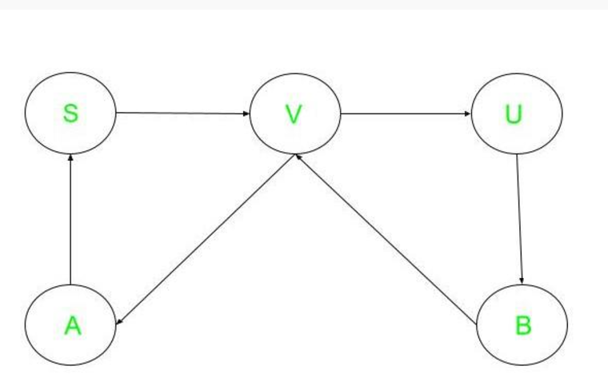
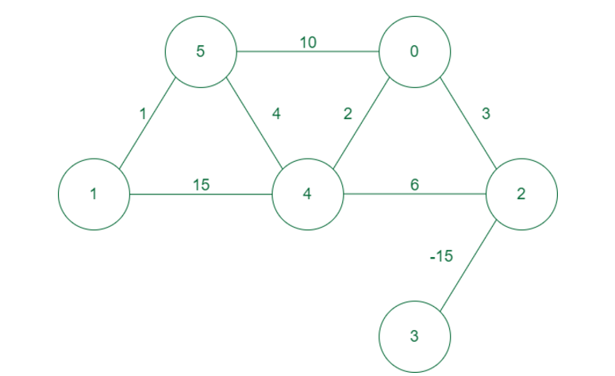

# Graph Concepts: Directed vs. Undirected and Weighted vs. Unweighted
## Overview
This project provides a comprehensive explanation of graph theory concepts, focusing on the differences between directed vs. undirected graphs and weighted vs. unweighted graphs. It serves as an educational resource for learners exploring data structures, algorithms, and their real-world applications.

### Directed and Undirectedd Graphs
Undirected and Directed graphs are fundamental concepts in graph theory, it is basically a branch of mathematics that deals with the study of graphs and it consists of a set of vertices(nodes) connected by edges. 

#### Undirected Graphs
 An undirected graph is a graph where the edges do not have a specific direction and it is bidirectional in nature it does not have a parent-child relation concept as there is no particular direction.

 

 **Characteristics of Undirected Graphs**

Edges are bidirectional and do not have a specific direction.

Each edge is an unordered pair of vertices.
There is no distinction between the two endpoints of an edge.

The graph is connected, meaning that there is a path between every pair of vertices.

The degree of each vertex represents the number of edges incident on it.

**Representation of Undirected Graphs**

Undirected graphs can be represented using an adjacency matrix or an edge list. In an adjacency matrix, the entry at row i and column j represents the weight of the edge between vertices i and j. In an edge list, each edge is represented as an unordered pair of vertices.

**Examples of Undirected Graphs**

Social networks, where each vertex represents an individual and each edge represents a friendship or connection between individuals.

Road networks, where each vertex represents an intersection or endpoint, and each edge represents a road.

Computer networks, where each vertex represents a device and each edge represents a connection between devices.

**Properties of Undirected Graphs**

Symmetry: Undirected graphs have symmetry, meaning that the adjacency matrix is symmetric.

Connectivity: Undirected graphs are connected, meaning that there is a path between every pair of vertices.

Degree: The degree of each vertex represents the number of edges incident on it.

**Operations on Undirected Graphs**

1. Adding or removing edges or vertices.

2. Finding the shortest path between two vertices.

3. Finding the minimum spanning tree of the graph.

4. Checking whether the graph is connected or not.
 

 #### Directed Graphs
 A directed graph is a graph that is unidirectional in this the edges have a specific direction and the edges have directions specified with them also a directed graph can contain cycles.

 

 **Characteristics of Directed Graphs**

**Asymmetry**:

Asymmetry is present in the directed graph as the edges are all one-way, so it’s not like everyone is on equal footing and the graph might not be connected, which means there might be some nodes that are totally out of the loop.

**Connectivity**:

In a directed graph, there may be more than one way to traverse from one vertex to another which means that the graph may not be connected.

**Applications of Directed Graph**:

**Computer networks**: Directed graphs are basically a way to represent the internet as a bunch of devices connected. 

**Project management**: Directed graph in project management the vertices will represent different tasks and the edges represent the dependencies between them. So basically, it’s a way to make sure everything gets done in the right order.

**When to Choose One Over the Other**

We can finally sum up what we learned about directed and undirected graphs. Here are some indications on how to choose which type to use:

Directed graphs are more informative than corresponding undirected graphs when the network is sparse. This means that if we treat a sparse directed graph as undirected we probably lose information

Directed graphs apply well to model relationships which are directional and not reciprocal in nature. A good example is a relationship “is a child of”, upon which we construct genealogical trees

Undirected graphs apply well to relationships for which it matters whether they exist or not, but aren’t intrinsically transitive. If, for example, we can go both ways in pedestrian paths, then we can model the pathways as an undirected graph

We can model the same system as a directed graph in some circumstances and as an undirected graph in others. For example, we can represent a family as a directed graph if we’re interested in studying progeny. If we’re studying clan affiliations, though, we can represent it as an undirected graph

Directed and undirected graphs are, by themselves, mathematical abstractions over real-world phenomena. As a consequence, a programmer should choose carefully which one to apply to a problem. The graph needs to correspond to the type of relationships which we model: undirected if it’s reciprocal, directed otherwise.

#### Weighted Graphs
A weighted graph is defined as a special type of graph in which the edges are assigned some weights which represent cost, distance, and many other relative measuring units.

**Applications of Weighted Graph**:

**2D matrix games**: In 2d matrix, games can be used to find the optimal path for maximum sum along starting to ending points and many variations of it can be found online.

**Spanning trees**: Weighted graphs are used to find the minimum spanning tree from graph which depicts the minimal cost to traverse all nodes in the graph.

**Constraints graphs**: Graphs are often used to represent constraints among items. Used in scheduling, product design, asset allocation, circuit design, and artificial intelligence.

**Dependency graphs**: Directed weighted graphs can be used 
Compilers: Weighted graphs are used extensively in compilers. They can be used for type inference, for so-called data flow analysis, and many other purposes such as query optimization in database languages.

**Artificial Intelligence**: Weighted graphs are used in artificial intelligence for decision-making processes, such as in game trees for determining the best move in a game.

**Image Processing**: Weighted graphs are used in image processing for segmentation, where the weight of the edges represents the similarity between two pixels.

**Natural Language Processing**: Weighted graphs are used in natural language processing for text classification, where the weight of the edges represents the similarity between two words.

# Dynamic Programming

**Dynamic Programming** is a method for designing algorithms.

An algorithm designed with Dynamic Programming divides the problem into subproblems, finds solutions to the subproblems, and puts them together to form a complete solution to the problem we want to solve.

To design an algorithm for a problem using Dynamic Programming, the problem we want to solve must have these two properties:

**Overlapping Subproblems**: Means that the problem can be broken down into smaller subproblems, where the solutions to the subproblems are overlapping. Having subproblems that are overlapping means that the solution to one subproblem is part of the solution to another subproblem.

**Optimal Substructure**: Means that the complete solution to a problem can be constructed from the solutions of its smaller subproblems. So not only must the problem have overlapping subproblems, the substructure must also be optimal so that there is a way to piece the solutions to the subproblems together to form the complete solution.

**Components of Dynamic programming**

1.**Stages**

The given problem can be divided into a number of subproblems which are called stages. A stage is a small portion of given problem.

2.**States**

This indicates the subproblem for which the decision has to be taken. The variables which are used for taking a decision at every stage that is called as a state variable.

3.**Decision**

At every stage, there can be multiple decisions out of which one of the best decisions should be taken. The decision taken at each stage should be optimal; this is called as a stage decision.

4.**Optimal policy**

It is a rule which determines the decision at each and every stage; a policy is called an optimal policy if it is globally optimal. This is called as Bellman principle of optimality.

**Applications of dynamic programming**

1.0/1 knapsack problem

2.Mathematical optimization problem

3.All pair Shortest path problem

4.Reliability design problem

5.Longest common subsequence (LCS)

6.Flight control and robotics control

7.Time sharing: It schedules the job to maximize CPU usage

**Elements of dynamic programming**

Dynamic programming posses two important elements which are as given below:

**Overlapping sub problem**

One of the main characteristics is to split the problem into subproblem, as similar as divide and conquer approach. The overlapping subproblem is found in that problem where bigger problems share the same smaller problem. However unlike divide and conquer there are many subproblems in which overlap cannot be treated distinctly or independently. Basically, there are two ways for handling the overlapping subproblems:

**Top down approach**

It is also termed as memoization technique. In this, the problem is broken into subproblem and these subproblems are solved and the solutions are remembered, in case if they need to be solved in future. Which means that the values are stored in a data structure, which will help us to reach them efficiently when the same problem will occur during the program execution.

**Bottom up approach**

It is also termed as tabulation technique. In this, all subproblems are needed to be solved in advance and then used to build up a solution to the larger problem.

**Optimal sub structure**

It implies that the optimal solution can be obtained from the optimal solution of its subproblem. So optimal substructure is simply an optimal selection among all the possible substructures that can help to select the best structure of the same kind to exist.

**Comparison between feasible and optimal solution**

1) **Feasible solution**

While solving a problem by using a greedy approach, the solution is obtained in a number of stages. The solution which satisfies the problem constraints they are called a feasible solution.

2) **Optimal solution**

Among all the feasible solution if the best solution either it can have a minimum or maximum value is chosen it is an optimal solution.

**Real life applications of Dynamic Programming**

1.**Resource Allocation**:

 **Knapsack Problem**: In logistics and finance, dynamic programming can help determine the most valuable combination of items to include in a knapsack without exceeding a weight limit. This is useful in cargo loading and investment portfolio selection.

2.**Operations Research**:

 **Shortest Path Problems**: Algorithms like Bellman-Ford and Floyd-Warshall use dynamic programming to find the shortest paths in graphs. This is applicable in routing and network design.

3.**Bioinformatics**:

 **Sequence Alignment**: DP is used in algorithms like Needleman-Wunsch and Smith-Waterman for aligning DNA, RNA, or protein sequences, which is crucial for evolutionary biology and genomics.

4.**Game Theory**:

 **Optimal Strategies**: Dynamic programming helps in solving games and decision-making problems, such as determining the best move in chess or other strategic games.

5.**Economics**:

 **Dynamic Pricing**: Companies use DP to optimize pricing strategies over time, considering factors like demand elasticity and inventory levels to maximize revenue.

6.**Machine Learning**:

 **Hidden Markov Models**: DP algorithms like the Viterbi algorithm are used for training and decoding sequences in HMMs, which are widely used in speech recognition and natural language processing.

7.**Network Design**:

**Bandwidth Allocation**: DP can optimize how bandwidth is allocated across different network paths, ensuring efficient data transmission while minimizing congestion.

8.**Computer Graphics**:

**Image Processing**: Algorithms for image segmentation and object recognition can utilize dynamic programming to optimize various parameters and improve processing efficiency.

9.**Finance**:

**Option Pricing**: Dynamic programming techniques, such as the binomial options pricing model, are used to evaluate financial derivatives.

10.**Robotics**:

**Path Planning**: Dynamic programming is applied in robotics for motion planning, helping robots determine the most efficient path while avoiding obstacles.

